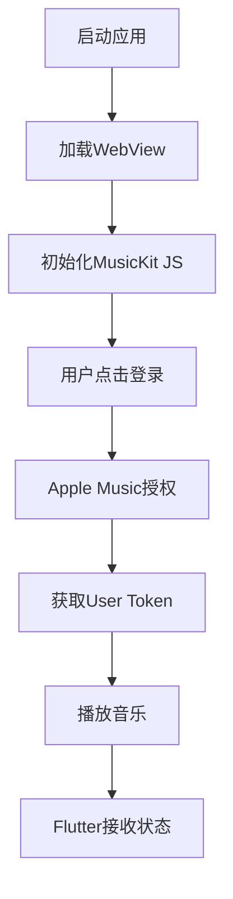

# 🎵 Apple Music 真实集成指南

## 📋 项目概述

本指南将帮助您在Flutter应用中集成**真正的Apple Music功能**，包括：
- 真实的Apple Music登录
- 播放Apple Music曲库中的歌曲
- 用户音乐数据访问
- 完整的播放控制

## 🚀 快速开始

### 1. 前置要求

- **Apple开发者账户** (付费账户，$99/年)
- **MusicKit权限** (需要申请)
- **Node.js** (用于生成Developer Token)
- **Flutter开发环境**

### 2. Apple开发者配置

#### 步骤1: 申请MusicKit权限
```bash
1. 登录 https://developer.apple.com/account/
2. 进入 "Certificates, Identifiers & Profiles"
3. 选择 "Services" → "MusicKit"
4. 申请MusicKit权限 (可能需要几天审核)
```

#### 步骤2: 创建MusicKit私钥
```bash
1. 在开发者后台选择 "Keys"
2. 点击 "+" 创建新密钥
3. 选择 "MusicKit" 服务
4. 下载 .p8 私钥文件
5. 记录 Key ID 和 Team ID
```

### 3. 生成Developer Token

#### 安装依赖
```bash
cd tools
npm install
```

#### 配置Token生成器
编辑 `tools/generate_developer_token.js`:
```javascript
const CONFIG = {
  teamId: 'YOUR_TEAM_ID',        // 替换为你的Team ID
  keyId: 'YOUR_KEY_ID',          // 替换为你的Key ID
  privateKeyFile: 'AuthKey_YOUR_KEY_ID.p8', // 私钥文件名
  expiresIn: '180d'              // Token有效期
};
```

#### 生成Token
```bash
# 将.p8私钥文件放到tools目录
cp AuthKey_YOUR_KEY_ID.p8 tools/

# 生成Developer Token
cd tools
npm run generate-token
```

### 4. 配置Flutter应用

#### 更新MusicKit配置
编辑 `assets/musickit/index.html`:
```javascript
// 替换为你生成的Developer Token
const DEVELOPER_TOKEN = 'eyJhbGciOiJFUzI1NiIsInR5cCI6IkpXVCIsImtpZCI6IlhYWFhYWFhYWFgifQ...';
```

#### 安装依赖
```bash
flutter pub get
```

## 🎯 功能特性

### ✅ 已实现功能

1. **WebView集成**
   - MusicKit JS加载
   - Apple Music登录界面
   - 播放控制界面

2. **Flutter原生集成**
   - Apple Music服务管理
   - 播放状态同步
   - 用户认证状态

3. **双界面模式**
   - WebView模式：完整的Apple Music体验
   - 原生模式：Flutter控制界面

### 🔄 播放流程



## 📱 使用说明

### 启动应用
```bash
# 开发模式
flutter run

# Web模式
flutter run -d chrome

# 构建发布版本
flutter build apk
```

### 操作步骤

1. **登录Apple Music**
   - 点击"🍎 登录 Apple Music"按钮
   - 使用真实的Apple ID登录
   - 完成两步验证（如果启用）

2. **播放音乐**
   - 在WebView中搜索歌曲
   - 点击播放按钮
   - 或使用快捷播放按钮

3. **界面切换**
   - 点击右上角眼睛图标
   - 在WebView和原生界面间切换

## 🔧 技术实现

### 架构图
```
┌─────────────────┐    ┌─────────────────┐
│   Flutter App   │    │   WebView       │
│                 │    │                 │
│ ┌─────────────┐ │    │ ┌─────────────┐ │
│ │ UI Controls │ │◄──►│ │ MusicKit JS │ │
│ └─────────────┘ │    │ └─────────────┘ │
│                 │    │                 │
│ ┌─────────────┐ │    │ ┌─────────────┐ │
│ │ State Mgmt  │ │◄──►│ │ Apple Music │ │
│ └─────────────┘ │    │ └─────────────┘ │
└─────────────────┘    └─────────────────┘
```

### 核心组件

1. **AppleMusicService**
   - 管理WebView通信
   - 处理播放状态
   - 用户认证管理

2. **WebView集成**
   - JavaScript通道
   - 状态同步
   - 事件处理

3. **MusicKit JS**
   - Apple Music API
   - 用户授权
   - 音乐播放

## 🛠️ 开发工具

### Developer Token生成器
```bash
cd tools
node generate_developer_token.js
```

### 调试模式
```bash
# 启用WebView调试
flutter run --debug

# 查看控制台日志
flutter logs
```

### 测试命令
```bash
# 运行测试
flutter test

# 分析代码
flutter analyze

# 格式化代码
dart format .
```

## 📂 项目结构

```
lib/
├── services/
│   ├── apple_music_service.dart    # Apple Music服务
│   ├── auth_service.dart           # 认证服务
│   └── music_service.dart          # 音乐服务
├── pages/
│   ├── real_apple_music_page.dart  # 主播放页面
│   └── login_page.dart             # 登录页面
└── main.dart                       # 应用入口

assets/
└── musickit/
    └── index.html                  # MusicKit JS界面

tools/
├── generate_developer_token.js     # Token生成器
└── package.json                    # Node.js依赖
```

## 🔐 安全注意事项

### Developer Token安全
- **不要**将Developer Token提交到版本控制
- 定期更新Token（最长180天）
- 使用环境变量存储敏感信息

### 用户隐私
- 遵循Apple隐私政策
- 明确告知用户数据使用方式
- 实现数据删除功能

## 🚨 常见问题

### Q: 无法登录Apple Music
**A:** 检查以下项目：
- Developer Token是否有效
- MusicKit权限是否已批准
- 网络连接是否正常

### Q: 播放失败
**A:** 可能原因：
- 歌曲在当前地区不可用
- 用户没有Apple Music订阅
- Token权限不足

### Q: WebView加载失败
**A:** 解决方案：
- 检查assets文件路径
- 确认WebView权限
- 查看控制台错误信息

## 📈 性能优化

### WebView优化
```dart
// 启用硬件加速
webController.setBackgroundColor(Colors.transparent);

// 预加载资源
webController.loadFlutterAsset('assets/musickit/index.html');
```

### 内存管理
```dart
@override
void dispose() {
  _appleMusicService.dispose();
  super.dispose();
}
```

## 🔄 更新日志

### v1.0.0 (2024-01-15)
- ✅ 初始版本发布
- ✅ MusicKit JS集成
- ✅ WebView双界面模式
- ✅ 基础播放功能

### 计划功能
- 🔄 播放列表管理
- 🔄 离线下载支持
- 🔄 社交分享功能
- 🔄 个性化推荐

## 📞 技术支持

### 获取帮助
- 📧 邮箱：support@example.com
- 💬 GitHub Issues
- 📱 技术交流群

### 贡献代码
1. Fork项目
2. 创建功能分支
3. 提交Pull Request
4. 代码审查

## 📄 许可证

本项目采用 MIT 许可证 - 查看 [LICENSE](LICENSE) 文件了解详情。

---

**🎵 享受真正的Apple Music体验！** 